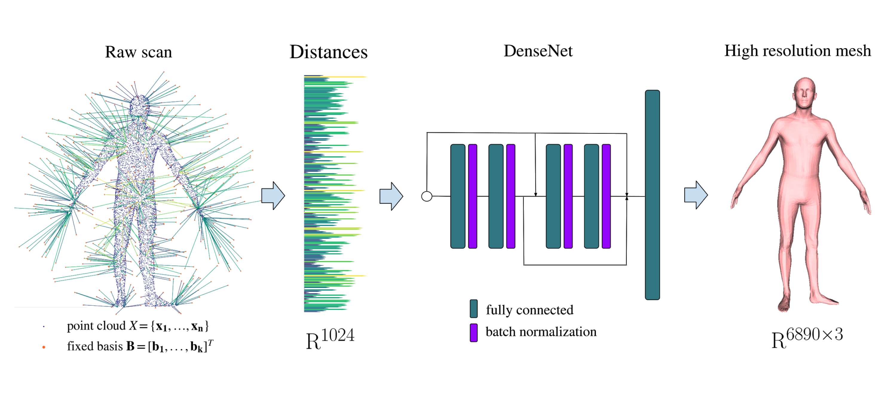
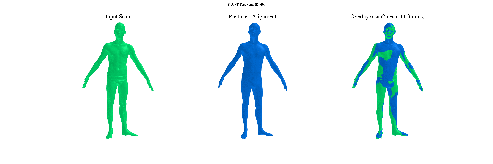
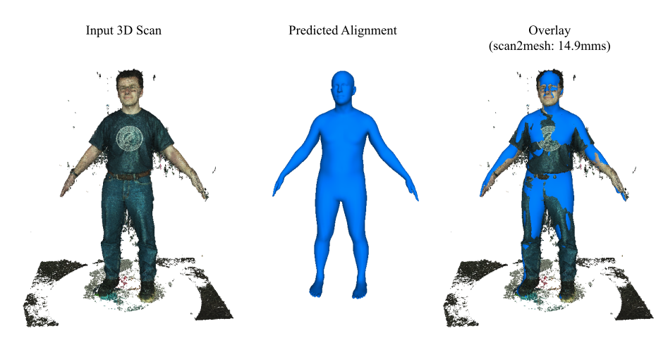

# Efficient Learning on Point Clouds with Basis Point Sets

__*Update*__: pure [PyTorch implementation](https://github.com/otaheri/bps_torch) of the BPS encoding is now available, thanks to [Omid Taheri](https://github.com/otaheri).

**Basis Point Set (BPS)** is a simple and efficient method for encoding 3D point clouds into fixed-length 
representations.

It is based on a _**simple idea**_: select k fixed points in space and compute vectors from  these basis points to the nearest
points in a point cloud; use these vectors (or simply their norms) as features:


The basis points are kept fixed for all the point clouds in the dataset, providing a fixed representation of every 
point cloud as a vector. This representation can then be used  as input to arbitrary machine learning methods, in 
particular it can be used as input to off-the-shelf neural networks. 

Below is the example of a simple model using  BPS features as input for the  task of mesh registration over a 
noisy scan:



**FAQ**: what are the key differences between _**standard occupancy voxels, TSDF**_ and the proposed BPS representation?

- continuous global vectors instead of simple binary flags or local distances in the cells;
- smaller number of cells required to represent shape accurately;
- BPS cell arrangement could be different from a standard rectangular grid, allowing different types of convolutions;
- significant improvement in performance: simply substituting occupancy voxels with  BPS directional vectors results 
in a +9% accuracy improvement of a VoxNet-like 3D-convolutional network on a ModelNet40 classification 
challenge.

 Check our [ICCV 2019 paper](https://arxiv.org/abs/1908.09186) for more 
 details.

## Citation

If you find our work useful in your research, please consider citing:
```
@inproceedings{prokudin2019efficient,
  title={Efficient Learning on Point Clouds With Basis Point Sets},
  author={Prokudin, Sergey and Lassner, Christoph and Romero, Javier},
  booktitle={Proceedings of the IEEE International Conference on Computer Vision},
  pages={4332--4341},
  year={2019}
}
```

## Usage
 
### Requirements

- Python >= 3.7;
- scikit-learn >= 0.21;
- tqdm >= 4.3;
- PyTorch >= 1.3 (for running provided demos)
- trimesh, pillow, pyntcloud (for running human mesh registration code)
- [psbody-mesh](https://github.com/MPI-IS/mesh) (to compute FAUST registrations correspondences)

### Installation


```
pip3 install git+https://github.com/sergeyprokudin/bps
```

### Code snippet


Converting point clouds to BPS representation takes few lines of code:

```
import numpy as np
from bps import bps

# batch of 100 point clouds to convert
x = np.random.normal(size=[100, 2048, 3])

# optional point cloud normalization to fit a unit sphere
x_norm = bps.normalize(x)

# option 1: encode with 1024 random basis and distances as features
x_bps_random = bps.encode(x_norm, bps_arrangement='random', n_bps_points=1024, bps_cell_type='dists')

# option 2: encode with 32^3 grid basis and full vectors to nearest points as features
x_bps_grid = bps.encode(x_norm, bps_arrangement='grid', n_bps_points=32**3, bps_cell_type='deltas')
# the following tensor can be provided as input to any Conv3D network:
x_bps_grid = x_bps_grid.reshape([-1, 32, 32, 32, 3])
```

### Demos

Clone the repository and install the dependencies:

```
git clone https://github.com/sergeyprokudin/bps
cd bps
python setup.py install
pip3 install torch h5py
```


Check one of the provided examples:

- **ModelNet40 3D shape classification with BPS-MLP** (~89% accuracy, ~30 minutes of training on a non-GPU MacBook Pro, 
~3 minutes of training on Nvidia V100 16gb):

```
python bps_demos/train_modelnet_mlp.py
```

- **ModelNet40 3D shape classification with BPS-Conv3D** (~92% accuracy, ~120 minutes of training on Nvidia V100 16gb):

```
python bps_demos/train_modelnet_conv3d.py
```

- **FAUST body mesh registration**: check [tutorial notebook](https://github.com/sergeyprokudin/bps/blob/master/bps_demos/Mesh%20Registration%20from%203D%20Scans%20(FAUST%20evaluation).ipynb) to run the evaluation of the pre-trained model.

You can directly download the results (predicted alignments, computed correspondences, demo video) [here](https://www.dropbox.com/s/gvo2hyvh6okwty3/faust_logs.zip?dl=0).

Results are also visualised in [this video](https://www.dropbox.com/s/2ir8p4m24tm8cpj/faust_test_demo.mp4?dl=0).



- **Running pre-trained model on your own 3D body scans**: download the model checkpoint ([mirror](https://drive.google.com/open?id=19uJp7jeQRdx3rviE7VFD5GkglxvFbzfh)):
```
mkdir data
cd data
wget --output-document=mesh_regressor.h5 https://www.dropbox.com/s/u3d1uighrtcprh2/mesh_regressor.h5?dl=0
```

Run the model, providing the paths to your own *.ply file and output directory. You can test that everything works by running the following synthetic example:

```
cd bps_demos
python run_alignment.py demo_scan.ply ../logs/demo_output
```

If a directory is provided as a first parameter, the alignment model will be ran on all *.ply files found. 

Here is an example of a prediction on some noisy real scan:




## License

This library is licensed under the MIT-0 License. See the LICENSE file.

_**Note**_: this is the official fork of the [Amazon repository](https://github.com/amzn/basis-point-sets) written by the 
same author during the time of internship. Latest features and bug fixes are likely to appear here first. 

